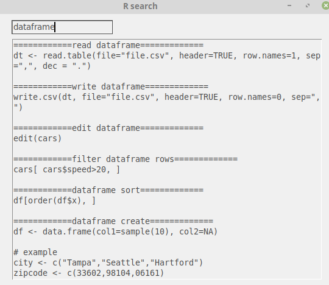
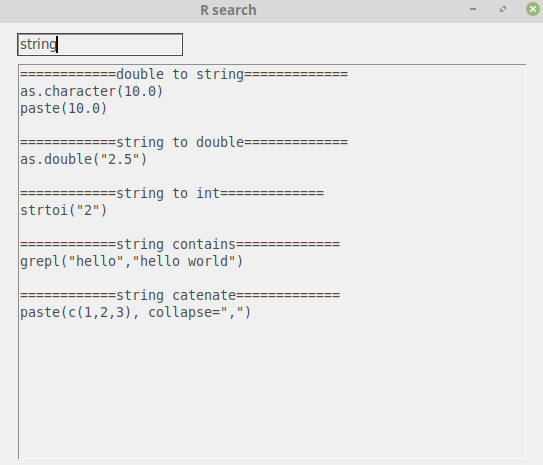

# Rhs
R language local reference utility

Rhs - is a tkinter-based utility(__works using base installation of Python both in Windows and Linux__) for R reference requests.

1) **Order of words is not strict**.
2) You can input only a **subset of request** (e.g. "dataframe" will be equal to "dataframe select columns","dataframe sort", etc).

